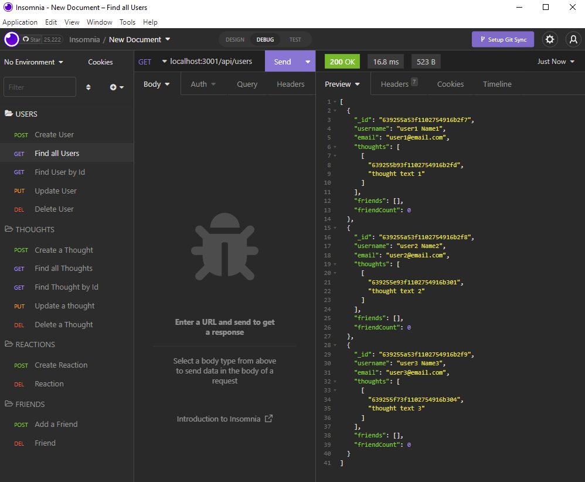

# social_networkAPI

Social network API that uses NoSQL database

[](https://opensource.org/licenses/MIT)

## Description

This application is a social media API that uses NoSQL database. Data can be added, update or deleted using Insomnia.



## Demo Video available at:

Please follow the below link to the demo video demonstration:

https://drive.google.com/file/d/145iyzFAxnzFDRSvXlr_smQCasb1pPjDC/view

## Table of Contents

- [Installation](#installation)
- [Usage](#usage)
- [Features](#features)
- [License](#license)
- [Contributing](#contributing)
- [Tests](#tests)
- [Questions](#questions)
- [Credits](#credits)

## Installation

MongoDB + npm i packages:
```
"dayjs": "^1.11.6",
"express": "^4.18.2",
"mongoose": "^6.7.5",
"mongoose-type-email": "^1.1.2"
```
## Usage

The user can use the below routes in Insomnia to add, update or delete data:
````
localhost:3001/api/
````

Localhost above in addition with the following routes:

### POST Routes
1. POST - /users - Create a new user
2. POST - /thoughts - Create a new thought
3. POST - /users/:userId/friends/:friendId - Add a new Friend
4. POST - /thoughts/:thoughtId/reactions/ - Create a reaction

### GET Routes
1. GET - /users/ - Get all users
2. GET - /users/:userId - Get single user
3. GET - /thoughts/ - Get all thoughts
4. GET - /thoughts/:thoughtId - Get single thought

### PUT Routes
1. PUT - /users/:userId - Update a user
2. PUT - /thoughts/:thoughtId - Update a thought

### DELETE Routes
1. DELETE - /users/:userId - Delete a User
2. DELETE - /thoughts/:thoughtId - Delete a thought
3. DELETE - /users/:userId/friends/:friendId - Delete a friend
4. DELETE - /thoughts/:thoughtId/reactions/:reactionId - Delete a Reaction

## Features

The user can create, update and delete users and thoughts in mongoDB database.

## License

[](https://opensource.org/licenses/MIT)

This application is covered by MIT license, available at:
https://opensource.org/licenses/MIT

## Contributing

Please feel free to send a pull request, the following is my GitHub account: https://github.com/Renatatims

## Tests

You can test the application by running `npm start` in the terminal. A schema with models will be created in MongoDB Compass, and data can be added, updated or deleted using Insomnia.

## Questions

If you have any questions please contact me at:

- GitHub account: https://github.com/Renatatims
- e-mail account: renatatims@gmail.com

## Credits

- https://www.npmjs.com/package/mongoose
- https://masteringjs.io/tutorials/mongoose/mongoose-validate-unique-email
- https://day.js.org/docs/en/installation/node-js
- https://www.npmjs.com/package/dayjs
